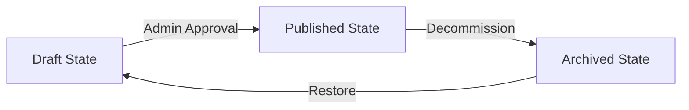

# Operator Guide: Content Management (`/crm/content`)

**Workspace**: `C:\zavlio`  
**Audience**: CRM Operators, Content Editors, Administrators  
**Route**: `/crm/content`

---

## 1. Overview & Capabilities

The Zavlio Content Management workspace provides a lightweight, secure, Postgres-backed editorial system for managing public-facing content across:

- **Services** (`services`)
- **Case Studies / Projects** (`projects`, `project_media`)
- **Lab Research Benchmarks** (`lab_projects`)
- **Editorial Insights** (`insights`, `authors`)

Public routes automatically resolve published records using `apps/web/src/lib/content-resolver.ts`, with zero draft leakage and graceful fallback to verified static content if database tables are unseeded.

---

## 2. Permissions & Roles (RBAC)

| Action                                   | VIEWER  |  OPERATOR   |    ADMIN    |    OWNER    |
| :--------------------------------------- | :-----: | :---------: | :---------: | :---------: |
| View content list & filter               | Allowed |   Allowed   |   Allowed   |   Allowed   |
| Create new draft item                    | Denied  | **Allowed** | **Allowed** | **Allowed** |
| Edit draft item content                  | Denied  | **Allowed** | **Allowed** | **Allowed** |
| Publish item (`draft` -> `published`)    | Denied  |   Denied    | **Allowed** | **Allowed** |
| Archive item (`published` -> `archived`) | Denied  |   Denied    | **Allowed** | **Allowed** |

---

## 3. Editorial Lifecycle

1. **Draft**: Content created by an OPERATOR. Visible only within `/crm/content`. Never rendered on public URLs or included in sitemap.
2. **Published**: Promoted by an ADMIN or OWNER. Rendered on public routes (`/work/[slug]`, `/insights/[slug]`, etc.) and included in `/sitemap.xml`.
3. **Archived**: Decommissioned content. Retained in database for audit and historical provenance; returns 404 or falls back on public routes.

---

## 4. Truth in Advertising & Claim Status Flags

Every case study or benchmark must carry an explicit claim status flag to maintain brand integrity:

- `STUDIO_CASE`: Real client project or studio capability demonstration.
- `REFERENCE_IMPLEMENTATION`: Architectural design pattern and reference code.
- `EXPERIMENTAL_BENCHMARK`: Research lab experiment with reproducible metrics.

**Zero Tolerance Policy**: Operators must never fabricate client names, testimonials, registered company entities, or performance metrics.
